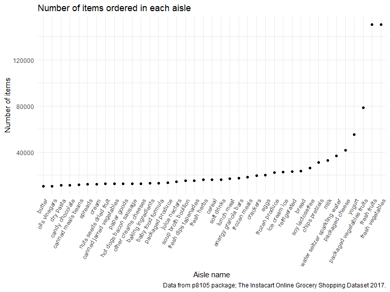

p8105_hw3_hm2900
================

## Problem 1

Load the data:

``` r
library(p8105.datasets)
data("instacart")

instacart
```

    ## # A tibble: 1,384,617 × 15
    ##    order_id product_id add_to_…¹ reord…² user_id eval_…³ order…⁴ order…⁵ order…⁶
    ##       <int>      <int>     <int>   <int>   <int> <chr>     <int>   <int>   <int>
    ##  1        1      49302         1       1  112108 train         4       4      10
    ##  2        1      11109         2       1  112108 train         4       4      10
    ##  3        1      10246         3       0  112108 train         4       4      10
    ##  4        1      49683         4       0  112108 train         4       4      10
    ##  5        1      43633         5       1  112108 train         4       4      10
    ##  6        1      13176         6       0  112108 train         4       4      10
    ##  7        1      47209         7       0  112108 train         4       4      10
    ##  8        1      22035         8       1  112108 train         4       4      10
    ##  9       36      39612         1       0   79431 train        23       6      18
    ## 10       36      19660         2       1   79431 train        23       6      18
    ## # … with 1,384,607 more rows, 6 more variables: days_since_prior_order <int>,
    ## #   product_name <chr>, aisle_id <int>, department_id <int>, aisle <chr>,
    ## #   department <chr>, and abbreviated variable names ¹​add_to_cart_order,
    ## #   ²​reordered, ³​eval_set, ⁴​order_number, ⁵​order_dow, ⁶​order_hour_of_day

The dimension of the dataset is 1384617 × 15, which contains 15
variables: order_id, product_id, add_to_cart_order, reordered, user_id,
eval_set, order_number, order_dow, order_hour_of_day,
days_since_prior_order, product_name, aisle_id, department_id, aisle,
department. Some key variables: the variable add_to_cart_order
represents the order in which each product was added to cart; the
variable reordered has the value 1 if this product has been ordered by
this user in the past, 0 otherwise; the variable eval_set represents
which evaluation set this order belongs in; the variable order_dow
represents the day of the week on which the order was placed; the
variable days_since_prior_order represents days since the last order,
capped at 30, NA if order_number=1.

How many aisles are there, and which aisles are the most items ordered
from?

``` r
instacart %>%
  summarize(
    n_aisle = n_distinct(aisle))
```

    ## # A tibble: 1 × 1
    ##   n_aisle
    ##     <int>
    ## 1     134

``` r
instacart %>%
  group_by(aisle) %>%
  summarize(n_items = n()) %>%
  mutate(items_rank = min_rank(desc(n_items))) %>%
  filter(items_rank == 1)
```

    ## # A tibble: 1 × 3
    ##   aisle            n_items items_rank
    ##   <chr>              <int>      <int>
    ## 1 fresh vegetables  150609          1

There are 134 aisles. The most items are ordered from the aisle ‘fresh
vegetables’.

Make a plot that shows the number of items ordered in each aisle,
limiting this to aisles with more than 10000 items ordered.

``` r
instacart %>%
  group_by(aisle) %>%
  summarize(n_items = n()) %>%
  filter(n_items > 10000) %>%
  ggplot(aes(x = n_items, y = aisle, color = aisle)) +
  geom_point() +
  labs(
    title = "Number of items ordered in each aisle",
    x = "Number of items",
    y = "Aisle name",
    caption = "Data from p8105 package; The Instacart Online Grocery Shopping Dataset 2017."
  )
```



Make a table showing the three most popular items in each of the aisles
“baking ingredients”, “dog food care”, and “packaged vegetables fruits”.
Include the number of times each item is ordered in your table.

``` r
instacart %>%
  group_by(aisle, product_name) %>%
  summarize(n_product = n()) %>%
  filter(aisle %in% c("baking ingredients", "dog food care", "packaged vegetables fruits")) %>%
  mutate(popular_rank = min_rank(desc(n_product))) %>%
  filter(popular_rank %in% c(1, 2, 3)) %>%
  arrange(aisle, popular_rank)
```

    ## # A tibble: 9 × 4
    ## # Groups:   aisle [3]
    ##   aisle                      product_name                        n_pro…¹ popul…²
    ##   <chr>                      <chr>                                 <int>   <int>
    ## 1 baking ingredients         Light Brown Sugar                       499       1
    ## 2 baking ingredients         Pure Baking Soda                        387       2
    ## 3 baking ingredients         Cane Sugar                              336       3
    ## 4 dog food care              Snack Sticks Chicken & Rice Recipe…      30       1
    ## 5 dog food care              Organix Chicken & Brown Rice Recipe      28       2
    ## 6 dog food care              Small Dog Biscuits                       26       3
    ## 7 packaged vegetables fruits Organic Baby Spinach                   9784       1
    ## 8 packaged vegetables fruits Organic Raspberries                    5546       2
    ## 9 packaged vegetables fruits Organic Blueberries                    4966       3
    ## # … with abbreviated variable names ¹​n_product, ²​popular_rank

Make a table showing the mean hour of the day at which Pink Lady Apples
and Coffee Ice Cream are ordered on each day of the week; format this
table for human readers (i.e. produce a 2 x 7 table).

``` r
instacart %>%
  group_by(product_name, order_dow) %>%
  filter(product_name %in% c("Pink Lady Apples", "Coffee Ice Cream")) %>%
  summarize(mean_hour = mean(order_hour_of_day)) %>%
  mutate(
    day = case_when(
      order_dow ==  0 ~ "Sunday",
      order_dow ==  1 ~ "Monday",
      order_dow ==  2 ~ "Tuesday",
      order_dow ==  3 ~ "Wednesday",
      order_dow ==  4 ~ "Thursday",
      order_dow ==  5 ~ "Friday",
      order_dow ==  6 ~ "Saturday"
    )
  ) %>%
  select(product_name, day, mean_hour) %>%
  pivot_wider(
    names_from = day,
    values_from = mean_hour
  )
```

    ## # A tibble: 2 × 8
    ## # Groups:   product_name [2]
    ##   product_name     Sunday Monday Tuesday Wednesday Thursday Friday Saturday
    ##   <chr>             <dbl>  <dbl>   <dbl>     <dbl>    <dbl>  <dbl>    <dbl>
    ## 1 Coffee Ice Cream   13.8   14.3    15.4      15.3     15.2   12.3     13.8
    ## 2 Pink Lady Apples   13.4   11.4    11.7      14.2     11.6   12.8     11.9

## problem 2

Load the data:

``` r
accel_data = 
  read_csv("./accel_data.csv") %>%
  janitor::clean_names() %>%
  mutate(weekend = ifelse(day %in% c("Saturday", "Sunday"), 1, 0)) %>%
  select(week, day_id, day, weekend, everything())

accel_data
```

    ## # A tibble: 35 × 1,444
    ##     week day_id day      weekend activ…¹ activ…² activ…³ activ…⁴ activ…⁵ activ…⁶
    ##    <dbl>  <dbl> <chr>      <dbl>   <dbl>   <dbl>   <dbl>   <dbl>   <dbl>   <dbl>
    ##  1     1      1 Friday         0    88.4    82.2    64.4    70.0    75.0    66.3
    ##  2     1      2 Monday         0     1       1       1       1       1       1  
    ##  3     1      3 Saturday       1     1       1       1       1       1       1  
    ##  4     1      4 Sunday         1     1       1       1       1       1       1  
    ##  5     1      5 Thursday       0    47.4    48.8    46.9    35.8    49.0    44.8
    ##  6     1      6 Tuesday        0    64.8    59.5    73.7    45.7    42.4    58.4
    ##  7     1      7 Wednesd…       0    71.1   103.     68.5    45.4    37.8    18.3
    ##  8     2      8 Friday         0   675     542    1010     779     509     106  
    ##  9     2      9 Monday         0   291     335     393     335     263     675  
    ## 10     2     10 Saturday       1    64      11       1       1       1       1  
    ## # … with 25 more rows, 1,434 more variables: activity_7 <dbl>,
    ## #   activity_8 <dbl>, activity_9 <dbl>, activity_10 <dbl>, activity_11 <dbl>,
    ## #   activity_12 <dbl>, activity_13 <dbl>, activity_14 <dbl>, activity_15 <dbl>,
    ## #   activity_16 <dbl>, activity_17 <dbl>, activity_18 <dbl>, activity_19 <dbl>,
    ## #   activity_20 <dbl>, activity_21 <dbl>, activity_22 <dbl>, activity_23 <dbl>,
    ## #   activity_24 <dbl>, activity_25 <dbl>, activity_26 <dbl>, activity_27 <dbl>,
    ## #   activity_28 <dbl>, activity_29 <dbl>, activity_30 <dbl>, …

There are 1444 variables and 35 observations in this dataset. Totally
there are 5 weeks and each week contains 7 different days with the
activity counts for each minute of a 24-hour day starting at midnight.
The variable day has the value of 0 if the day is a weekday and value of
1 if the day is a weekend.

Using your tidied dataset, aggregate across minutes to create a total
activity variable for each day, and create a table showing these totals.

Are any trends apparent?

``` r
accel_data %>%
  pivot_longer(
    activity_1:activity_1440,
    names_to = "activity_minute",
    values_to = "activities"
  ) %>%
  group_by(week, day_id, day, weekend) %>%
  summarize(total_activitiy = sum(activities, na.rm = TRUE)) %>%
  knitr::kable()
```

| week | day_id | day       | weekend | total_activitiy |
|-----:|-------:|:----------|--------:|----------------:|
|    1 |      1 | Friday    |       0 |       480542.62 |
|    1 |      2 | Monday    |       0 |        78828.07 |
|    1 |      3 | Saturday  |       1 |       376254.00 |
|    1 |      4 | Sunday    |       1 |       631105.00 |
|    1 |      5 | Thursday  |       0 |       355923.64 |
|    1 |      6 | Tuesday   |       0 |       307094.24 |
|    1 |      7 | Wednesday |       0 |       340115.01 |
|    2 |      8 | Friday    |       0 |       568839.00 |
|    2 |      9 | Monday    |       0 |       295431.00 |
|    2 |     10 | Saturday  |       1 |       607175.00 |
|    2 |     11 | Sunday    |       1 |       422018.00 |
|    2 |     12 | Thursday  |       0 |       474048.00 |
|    2 |     13 | Tuesday   |       0 |       423245.00 |
|    2 |     14 | Wednesday |       0 |       440962.00 |
|    3 |     15 | Friday    |       0 |       467420.00 |
|    3 |     16 | Monday    |       0 |       685910.00 |
|    3 |     17 | Saturday  |       1 |       382928.00 |
|    3 |     18 | Sunday    |       1 |       467052.00 |
|    3 |     19 | Thursday  |       0 |       371230.00 |
|    3 |     20 | Tuesday   |       0 |       381507.00 |
|    3 |     21 | Wednesday |       0 |       468869.00 |
|    4 |     22 | Friday    |       0 |       154049.00 |
|    4 |     23 | Monday    |       0 |       409450.00 |
|    4 |     24 | Saturday  |       1 |         1440.00 |
|    4 |     25 | Sunday    |       1 |       260617.00 |
|    4 |     26 | Thursday  |       0 |       340291.00 |
|    4 |     27 | Tuesday   |       0 |       319568.00 |
|    4 |     28 | Wednesday |       0 |       434460.00 |
|    5 |     29 | Friday    |       0 |       620860.00 |
|    5 |     30 | Monday    |       0 |       389080.00 |
|    5 |     31 | Saturday  |       1 |         1440.00 |
|    5 |     32 | Sunday    |       1 |       138421.00 |
|    5 |     33 | Thursday  |       0 |       549658.00 |
|    5 |     34 | Tuesday   |       0 |       367824.00 |
|    5 |     35 | Wednesday |       0 |       445366.00 |

According to the table, we can see that the total activity number is
highest on Sunday in week 1 and on Saturday in week 2, while lowest on
Mondays for both of two weeks, which means that for the first two week,
there may be more activities on the weekends instead of weekdays.
However, for week 3, 4 and 5, the total activity number is highest on
Monday, Wednesday, and Friday. Especially for week 4 and 5, the total
activity numbers is lowest on Saturday. This indicate that for the
further week 3, 4, and 5, there may trend to be more activities on
weekdays instead of weekends.

Accelerometer data allows the inspection activity over the course of the
day. Make a single-panel plot that shows the 24-hour activity time
courses for each day and use color to indicate day of the week.

``` r
accel_data %>%
  pivot_longer(
    activity_1:activity_1440,
    names_to = "activity_minute",
    values_to = "activities"
  ) %>%
  separate(activity_minute, into = c("activity", "minute"), sep = 9) %>%
  mutate(minute = as.numeric(minute)) %>%
  ggplot(aes(x = minute, y = activities, color = day)) + 
  geom_line() + 
  labs(
    title = "24-Hour Activity Plot",
    x = "Hour",
    y = "Activities") +
  scale_x_continuous(
    breaks = seq(0, 1440, 60),
    labels = c("12am", "1am", "2am", "3am", "4am", "5am", "6am", "7am", "8am", "9am", "10am", "11am", "12pm", "1pm", "2pm", "3pm", "4pm", "5pm", "6pm", "7pm", "8pm", "9pm", "10pm", "11pm", "12am"))
```


Based on the plot, we can see that the maximum of accelerometer data is
between 6am to 11pm over the course of the day, while the minimum is
between 12am to 5am. Among the maximum accelerometer data period, there
are two peaks existing, one is between 11am to 12 pm on Sunday, and
another is between 8pm-10pm on Friday. These may indicate that people
prefer to use more accelerometer data before sleeping and when having
free time at noon.
