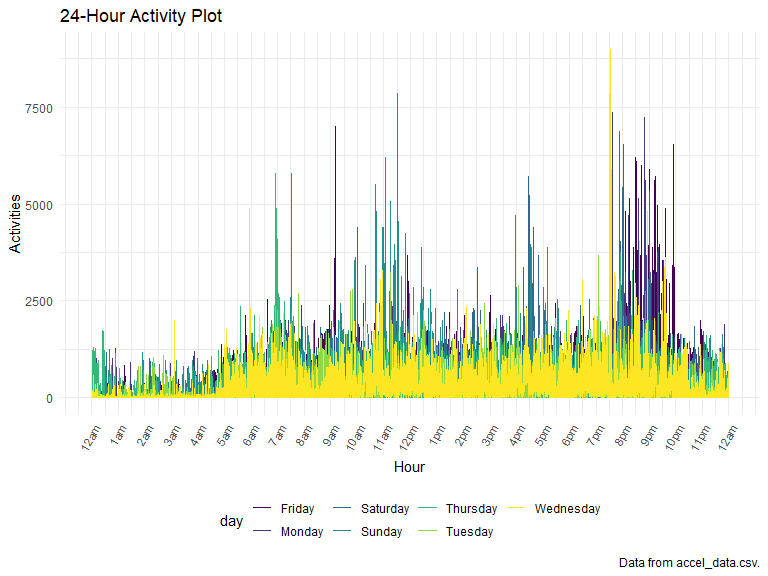
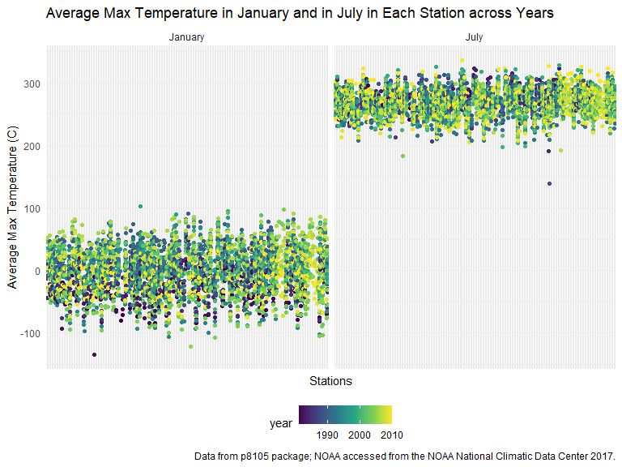

p8105_hw3_hm2900
================

## Problem 1

### Load the data:

``` r
library(p8105.datasets)
data("instacart")

instacart = 
  instacart %>% 
  as_tibble(instacart)
```

This dataset contains 1384617 rows and 15 columns, with each row
resprenting a single product from an instacart order. Variables include
identifiers for user, order, and product; the order in which each
product was added to the cart. There are several order-level variables,
describing the day and time of the order, and number of days since prior
order. Then there are several item-specific variables, describing the
product name (e.g. Yogurt, Avocado), department (e.g. dairy and eggs,
produce), and aisle (e.g. yogurt, fresh fruits), and whether the item
has been ordered by this user in the past. In total, there are 39123
products found in 131209 orders from 131209 distinct users.

### How many aisles are there, and which aisles are the most items ordered from?

``` r
instacart %>%
  summarize(
    n_aisle = n_distinct(aisle))
```

    ## # A tibble: 1 × 1
    ##   n_aisle
    ##     <int>
    ## 1     134

``` r
instacart %>% 
  count(aisle) %>% 
  arrange(desc(n))
```

    ## # A tibble: 134 × 2
    ##    aisle                              n
    ##    <chr>                          <int>
    ##  1 fresh vegetables              150609
    ##  2 fresh fruits                  150473
    ##  3 packaged vegetables fruits     78493
    ##  4 yogurt                         55240
    ##  5 packaged cheese                41699
    ##  6 water seltzer sparkling water  36617
    ##  7 milk                           32644
    ##  8 chips pretzels                 31269
    ##  9 soy lactosefree                26240
    ## 10 bread                          23635
    ## # … with 124 more rows

There are 134 aisles. The most items are ordered from the aisle ‘fresh
vegetables’ and ‘fresh fruits’.

### Make a plot that shows the number of items ordered in each aisle, limiting this to aisles with more than 10000 items ordered.

``` r
instacart %>% 
  count(aisle) %>% 
  filter(n > 10000) %>% 
  mutate(aisle = fct_reorder(aisle, n)) %>% 
  ggplot(aes(x = aisle, y = n)) + 
  geom_point() + 
  labs(
    title = "Number of items ordered in each aisle",
    x = "Aisle name",
    y = "Number of items",
    caption = "Data from p8105 package; The Instacart Online Grocery Shopping Dataset 2017."
  ) +
  theme(axis.text.x = element_text(angle = 60, hjust = 1))
```


### Make a table showing the three most popular items in each of the aisles “baking ingredients”, “dog food care”, and “packaged vegetables fruits”. Include the number of times each item is ordered in your table.

``` r
instacart %>%
  group_by(aisle) %>%
  filter(aisle %in% c("baking ingredients", "dog food care", "packaged vegetables fruits")) %>%
  count(product_name) %>% 
  mutate(popular_rank = min_rank(desc(n))) %>%
  filter(popular_rank %in% c(1, 2, 3)) %>%
  arrange(desc(n)) %>%
  knitr::kable()
```

| aisle                      | product_name                                  |    n | popular_rank |
|:---------------------------|:----------------------------------------------|-----:|-------------:|
| packaged vegetables fruits | Organic Baby Spinach                          | 9784 |            1 |
| packaged vegetables fruits | Organic Raspberries                           | 5546 |            2 |
| packaged vegetables fruits | Organic Blueberries                           | 4966 |            3 |
| baking ingredients         | Light Brown Sugar                             |  499 |            1 |
| baking ingredients         | Pure Baking Soda                              |  387 |            2 |
| baking ingredients         | Cane Sugar                                    |  336 |            3 |
| dog food care              | Snack Sticks Chicken & Rice Recipe Dog Treats |   30 |            1 |
| dog food care              | Organix Chicken & Brown Rice Recipe           |   28 |            2 |
| dog food care              | Small Dog Biscuits                            |   26 |            3 |

### Make a table showing the mean hour of the day at which Pink Lady Apples and Coffee Ice Cream are ordered on each day of the week; format this table for human readers (i.e. produce a 2 x 7 table).

``` r
instacart %>%
  group_by(product_name, order_dow) %>%
  filter(product_name %in% c("Pink Lady Apples", "Coffee Ice Cream")) %>%
  summarize(mean_hour = mean(order_hour_of_day)) %>%
  select(product_name, order_dow, mean_hour) %>%
  pivot_wider(
    names_from = order_dow,
    values_from = mean_hour
  ) %>%
  knitr::kable()
```

| product_name     |        0 |        1 |        2 |        3 |        4 |        5 |        6 |
|:-----------------|---------:|---------:|---------:|---------:|---------:|---------:|---------:|
| Coffee Ice Cream | 13.77419 | 14.31579 | 15.38095 | 15.31818 | 15.21739 | 12.26316 | 13.83333 |
| Pink Lady Apples | 13.44118 | 11.36000 | 11.70213 | 14.25000 | 11.55172 | 12.78431 | 11.93750 |

## problem 2

### Load the data:

``` r
accel_data = 
  read_csv("./accel_data.csv") %>%
  janitor::clean_names() %>%
  mutate(weekend = ifelse(day %in% c("Saturday", "Sunday"), 1, 0)) %>%
  select(week, day_id, day, weekend, everything())

accel_data
```

    ## # A tibble: 35 × 1,444
    ##     week day_id day      weekend activ…¹ activ…² activ…³ activ…⁴ activ…⁵ activ…⁶
    ##    <dbl>  <dbl> <chr>      <dbl>   <dbl>   <dbl>   <dbl>   <dbl>   <dbl>   <dbl>
    ##  1     1      1 Friday         0    88.4    82.2    64.4    70.0    75.0    66.3
    ##  2     1      2 Monday         0     1       1       1       1       1       1  
    ##  3     1      3 Saturday       1     1       1       1       1       1       1  
    ##  4     1      4 Sunday         1     1       1       1       1       1       1  
    ##  5     1      5 Thursday       0    47.4    48.8    46.9    35.8    49.0    44.8
    ##  6     1      6 Tuesday        0    64.8    59.5    73.7    45.7    42.4    58.4
    ##  7     1      7 Wednesd…       0    71.1   103.     68.5    45.4    37.8    18.3
    ##  8     2      8 Friday         0   675     542    1010     779     509     106  
    ##  9     2      9 Monday         0   291     335     393     335     263     675  
    ## 10     2     10 Saturday       1    64      11       1       1       1       1  
    ## # … with 25 more rows, 1,434 more variables: activity_7 <dbl>,
    ## #   activity_8 <dbl>, activity_9 <dbl>, activity_10 <dbl>, activity_11 <dbl>,
    ## #   activity_12 <dbl>, activity_13 <dbl>, activity_14 <dbl>, activity_15 <dbl>,
    ## #   activity_16 <dbl>, activity_17 <dbl>, activity_18 <dbl>, activity_19 <dbl>,
    ## #   activity_20 <dbl>, activity_21 <dbl>, activity_22 <dbl>, activity_23 <dbl>,
    ## #   activity_24 <dbl>, activity_25 <dbl>, activity_26 <dbl>, activity_27 <dbl>,
    ## #   activity_28 <dbl>, activity_29 <dbl>, activity_30 <dbl>, …

There are 1444 variables and 35 observations in this dataset. Totally
there are 5 weeks and each week contains 7 different days with the
activity counts for each minute of a 24-hour day starting at midnight.
The variable day has the value of 0 if the day is a weekday and value of
1 if the day is a weekend.

### Using your tidied dataset, aggregate across minutes to create a total activity variable for each day, and create a table showing these totals. Are any trends apparent?

``` r
accel_data %>%
  pivot_longer(
    activity_1:activity_1440,
    names_to = "activity_minute",
    values_to = "activities"
  ) %>%
  group_by(week, day_id, day, weekend) %>%
  summarize(total_activitiy = sum(activities, na.rm = TRUE)) %>%
  knitr::kable()
```

| week | day_id | day       | weekend | total_activitiy |
|-----:|-------:|:----------|--------:|----------------:|
|    1 |      1 | Friday    |       0 |       480542.62 |
|    1 |      2 | Monday    |       0 |        78828.07 |
|    1 |      3 | Saturday  |       1 |       376254.00 |
|    1 |      4 | Sunday    |       1 |       631105.00 |
|    1 |      5 | Thursday  |       0 |       355923.64 |
|    1 |      6 | Tuesday   |       0 |       307094.24 |
|    1 |      7 | Wednesday |       0 |       340115.01 |
|    2 |      8 | Friday    |       0 |       568839.00 |
|    2 |      9 | Monday    |       0 |       295431.00 |
|    2 |     10 | Saturday  |       1 |       607175.00 |
|    2 |     11 | Sunday    |       1 |       422018.00 |
|    2 |     12 | Thursday  |       0 |       474048.00 |
|    2 |     13 | Tuesday   |       0 |       423245.00 |
|    2 |     14 | Wednesday |       0 |       440962.00 |
|    3 |     15 | Friday    |       0 |       467420.00 |
|    3 |     16 | Monday    |       0 |       685910.00 |
|    3 |     17 | Saturday  |       1 |       382928.00 |
|    3 |     18 | Sunday    |       1 |       467052.00 |
|    3 |     19 | Thursday  |       0 |       371230.00 |
|    3 |     20 | Tuesday   |       0 |       381507.00 |
|    3 |     21 | Wednesday |       0 |       468869.00 |
|    4 |     22 | Friday    |       0 |       154049.00 |
|    4 |     23 | Monday    |       0 |       409450.00 |
|    4 |     24 | Saturday  |       1 |         1440.00 |
|    4 |     25 | Sunday    |       1 |       260617.00 |
|    4 |     26 | Thursday  |       0 |       340291.00 |
|    4 |     27 | Tuesday   |       0 |       319568.00 |
|    4 |     28 | Wednesday |       0 |       434460.00 |
|    5 |     29 | Friday    |       0 |       620860.00 |
|    5 |     30 | Monday    |       0 |       389080.00 |
|    5 |     31 | Saturday  |       1 |         1440.00 |
|    5 |     32 | Sunday    |       1 |       138421.00 |
|    5 |     33 | Thursday  |       0 |       549658.00 |
|    5 |     34 | Tuesday   |       0 |       367824.00 |
|    5 |     35 | Wednesday |       0 |       445366.00 |

According to the table, we can see that the total activity number is
highest on Sunday in week 1 and on Saturday in week 2, while lowest on
Mondays for both of two weeks, which means that for the first two week,
there may be more activities on the weekends instead of weekdays.
However, for week 3, 4 and 5, the total activity number is highest on
Monday, Wednesday, and Friday. Especially for week 4 and 5, the total
activity numbers is lowest on Saturday. This indicate that for the
further week 3, 4, and 5, there may trend to be more activities on
weekdays instead of weekends.

### Accelerometer data allows the inspection activity over the course of the day. Make a single-panel plot that shows the 24-hour activity time courses for each day and use color to indicate day of the week.

``` r
accel_data %>%
  pivot_longer(
    activity_1:activity_1440,
    names_to = "activity_minute",
    values_to = "activities"
  ) %>%
  separate(activity_minute, into = c("activity", "minute"), sep = 9) %>%
  mutate(minute = as.numeric(minute)) %>%
  ggplot(aes(x = minute, y = activities, color = day)) + 
  geom_line() + 
  labs(
    title = "24-Hour Activity Plot",
    x = "Hour",
    y = "Activities",
    caption = "Data from accel_data.csv.") +
  scale_x_continuous(
    breaks = seq(0, 1440, 60),
    labels = c("12am", "1am", "2am", "3am", "4am", "5am", "6am", "7am", "8am", "9am", "10am", "11am", "12pm", "1pm", "2pm", "3pm", "4pm", "5pm", "6pm", "7pm", "8pm", "9pm", "10pm", "11pm", "12am")) +
  theme(axis.text.x = element_text(angle = 60, hjust = 1))
```



Based on the plot, we can see that the maximum of accelerometer data is
between 6am to 11pm over the course of the day, while the minimum is
between 12am to 5am. Among the maximum accelerometer data period, there
are two peaks existing, one is between 11am to 12 pm on Sunday, and
another is between 8pm-10pm on Friday. These may indicate that people
prefer to use more accelerometer data before sleeping and when having
free time at noon.

## Problem 3

### Load the data;

``` r
library(p8105.datasets)
data("ny_noaa")

ny_noaa
```

    ## # A tibble: 2,595,176 × 7
    ##    id          date        prcp  snow  snwd tmax  tmin 
    ##    <chr>       <date>     <int> <int> <int> <chr> <chr>
    ##  1 US1NYAB0001 2007-11-01    NA    NA    NA <NA>  <NA> 
    ##  2 US1NYAB0001 2007-11-02    NA    NA    NA <NA>  <NA> 
    ##  3 US1NYAB0001 2007-11-03    NA    NA    NA <NA>  <NA> 
    ##  4 US1NYAB0001 2007-11-04    NA    NA    NA <NA>  <NA> 
    ##  5 US1NYAB0001 2007-11-05    NA    NA    NA <NA>  <NA> 
    ##  6 US1NYAB0001 2007-11-06    NA    NA    NA <NA>  <NA> 
    ##  7 US1NYAB0001 2007-11-07    NA    NA    NA <NA>  <NA> 
    ##  8 US1NYAB0001 2007-11-08    NA    NA    NA <NA>  <NA> 
    ##  9 US1NYAB0001 2007-11-09    NA    NA    NA <NA>  <NA> 
    ## 10 US1NYAB0001 2007-11-10    NA    NA    NA <NA>  <NA> 
    ## # … with 2,595,166 more rows

This dataset contains 2595176 rows and 7 columns, representing station
id, date, and weather records from over 100,000 stations. Some of the
key variables such as prcp, snow, snwd describe the weather data of
Precipitation(tenths of mm), Snowfall(mm), and Snow depth(mm). The
variable tmax indicates the recorded maximum temperature (tenths of
degrees C), and the variable tmin indicates the recorded minimum
temperature (tenths of degrees C). Some of the values are missing as NA.
When we considering about the statistical analysis of one type of
weather data (such as the mean, the distribution, etc.), the missing
values would be an issue.

### For snowfall, what are the most commonly observed values? Why?

``` r
ny_noaa =
  ny_noaa %>%
  as_tibble(ny_noaa) %>%
  janitor::clean_names() %>%
  separate(date, into = c("year", "month", "day")) %>%
  mutate(year = as.numeric(year),
         month = as.numeric(month),
         day = as.numeric(day))

ny_noaa %>%
  count(snow) %>% 
  arrange(desc(n))
```

    ## # A tibble: 282 × 2
    ##     snow       n
    ##    <int>   <int>
    ##  1     0 2008508
    ##  2    NA  381221
    ##  3    25   31022
    ##  4    13   23095
    ##  5    51   18274
    ##  6    76   10173
    ##  7     8    9962
    ##  8     5    9748
    ##  9    38    9197
    ## 10     3    8790
    ## # … with 272 more rows

The most commonly observed values are 0. This is sensible since most of
the days do not have snow across years.

### Make a two-panel plot showing the average max temperature in January and in July in each station across years. Is there any observable / interpretable structure? Any outliers?

``` r
ny_noaa %>%
  filter(month %in% c(1, 7)) %>%
  drop_na(tmax) %>%
  mutate(tmax = as.numeric(tmax)) %>%
  mutate(month = recode(month, `1` = "January", `7` = "July")) %>%
  group_by(id, year, month) %>%
  summarize(avg_tmax = mean(tmax, na.rm = TRUE)) %>%
  ggplot(aes(x = id, y = avg_tmax, color = year)) + 
  geom_point() +
  labs(
    title = "Average Max Temperature in January and in July in Each Station across Years",
    x = "Stations",
    y = "Average Max Temperature (C)",
    caption = "Data from p8105 package; NOAA accessed from the NOAA National Climatic Data Center 2017.") + 
  theme(axis.text.x=element_blank()) +
  facet_grid(. ~ month)
```



The average max temperature in January in each station across years is
around 0C, with an approximate range between -100C to 100C, and it seems
get higher as year increasing. The average max temperature in July is
around 250C, with an approximate range between 200C to 320C. There are
some outliers in January lower than -100C and higher than 100C before
year 2000. There are extreme outliers in July which is lower than 150C
before year 1990, while most of the outliers in July are higher than
320C after year 2000.

### Make a two-panel plot showing (i) tmax vs tmin for the full dataset (note that a scatterplot may not be the best option); and (ii) make a plot showing the distribution of snowfall values greater than 0 and less than 100 separately by year.

``` r
tmax_tmin_plot = 
  ny_noaa %>%
  filter(!is.na(tmin),!is.na(tmax)) %>%
  mutate(tmax = as.numeric(tmax)) %>%
  mutate(tmin = as.numeric(tmin)) %>%
  ggplot(aes(x = tmin, y = tmax)) +
  geom_hex() +
  labs(
    title = "Max vs Min Temperature",
    x = "Min temperature (C)",
    y = "Max temperature (C)") +
  theme(legend.title = element_text(size = 9), 
        legend.text  = element_text(size = 5))

snowfall_plot = 
  ny_noaa %>%
  filter(!is.na(snow), snow > 0 & snow <100) %>%
  ggplot(aes(x = snow, y = as.factor(year), fill = year)) +
  geom_density_ridges(alpha = 0.5) +
  labs(
    title = "Distribution of Snowfall by Year",
    x = "Snowfall (mm)",
    y = "Year")

tmax_tmin_plot + snowfall_plot
```


